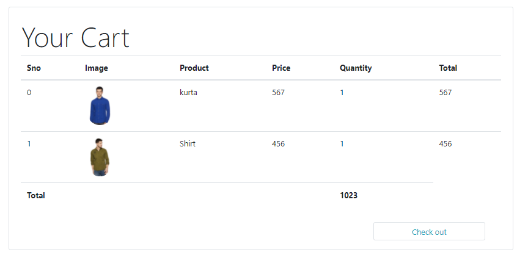
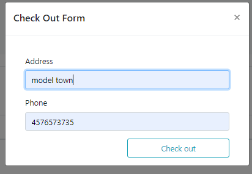
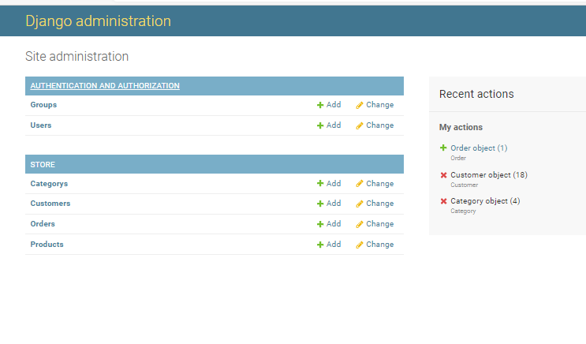

# Django E-Shopping Website

Welcome to our Django-based E-Shopping Website, your one-stop destination for online shopping. This project brings together the power of Django and modern web development to provide a seamless shopping experience. Whether you're a potential employer or a visitor interested in our project, you've come to the right place!

## Features

### Homepage

Our homepage offers a visually appealing and user-friendly interface, making it easy for customers to browse through a wide range of products.

### Shopping Cart

Customers can add products to their shopping cart, view cart contents, and proceed to checkout. The cart functionality allows for easy management of selected items.

### Checkout Form

The checkout process is straightforward and secure. Customers can provide their shipping and payment details, making it convenient for them to complete their purchase.

### Admin Panel

For website administrators, we offer a powerful admin panel to manage products, orders, and customers. This functionality simplifies the process of handling your e-commerce platform.

## How to Run

To run this Django E-Shopping Website locally, follow these steps:

1. Clone this repository: `git clone https://github.com/yourusername/eshopping-website.git`
2. Create a virtual environment and install dependencies: `pip install -r requirements.txt`
3. Apply migrations: `python manage.py migrate`
4. Create a superuser: `python manage.py createsuperuser`
5. Start the development server: `python manage.py runserver`

You can access the admin panel at `http://localhost:8000/admin/` to manage your website.

## Technologies Used

- **Django**: Our web framework of choice.
- **Bootstrap**: For responsive and attractive design.
- **SQLite**: As the database for simplicity, but it can be configured to use other databases.
- **JavaScript**: For enhancing user experience and cart functionality.

## About Us

We are passionate about e-commerce and delivering top-notch web solutions. This project reflects our dedication to creating a feature-rich online shopping experience. We are actively seeking opportunities to apply our Django expertise and contribute to your organization.

Feel free to explore the code, run the website, and contact us if you have any questions or job opportunities.

## Contact Us

For inquiries or potential collaboration, please reach out to Shoaib Abid(shoaibabid1760@gmail.com).

Thank you for visiting our GitHub repository and considering our Django E-Shopping Website for your job search!
